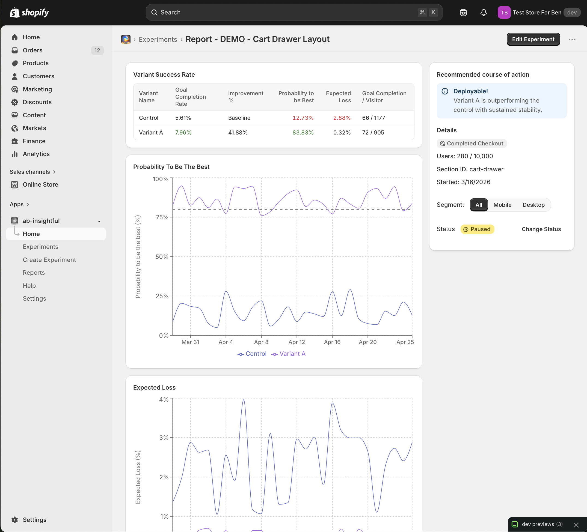
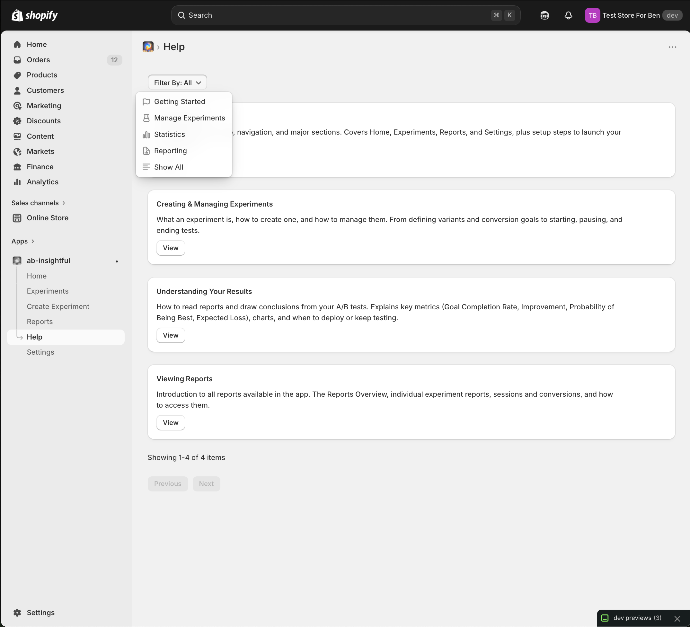
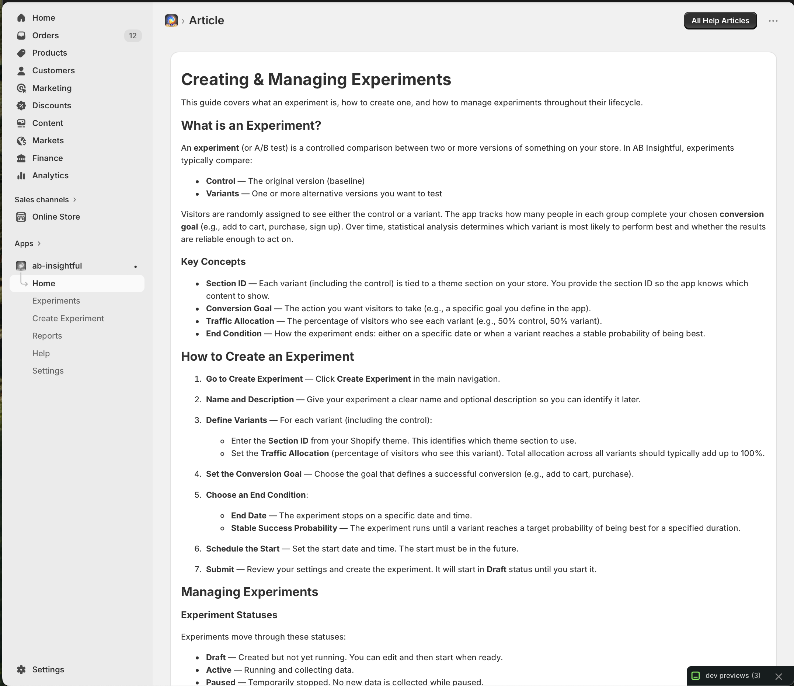
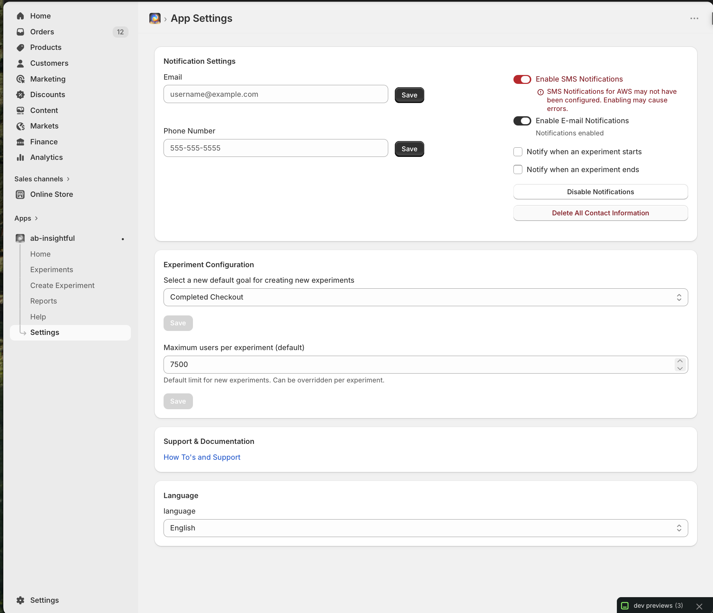
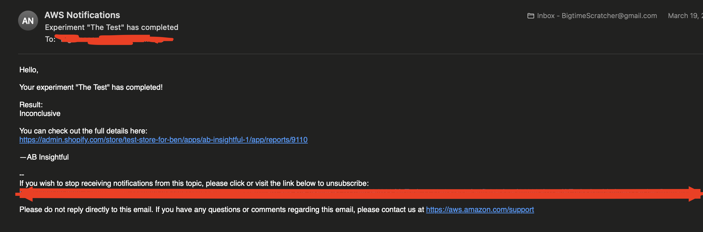

# AB Insightful


## Synopsis

Welcome to AB-Insightful! AB-Insightful helps Shopify merchants analyze customer engagement and customer conversion. AB-Insightful is unique from other A/B testing platforms because it is the first completely native-to-Shopify solution on the market that still offers robust customer tracking and insights. Our product utilizes Shopify’s theme extensions and Polaris Web Components Library to give merchants a familiar user interface and process for creating and deploying alternative websites that can be used for A/B testing. A core feature of our application is robust reporting. Merchants who install our app are able to view metrics such as conversion rates through intuitive UI and easy to read reports.

Our client was in need of an A/B testing application for conversion rate optimization to help improve sales on their platform. However, other options at the time were not as fully featured as they would have liked, and costed enterprise level annual fees. Therefore, AB-Insightful was created as an application that will which will improve the ability to objectively understand and optimize their website design. This application offers better web performance by integrating with the Shopify development framework while simultaneously being a more affordable application than the alternative implementations. Additionally, our team of students was able to treat this as an incredible learning experience, creating a new embedded application from start to scratch using software development strategies and techniques.

## Product Features

- [ ] Administrator interface – _Easily navigable interface that adheres to shopify style conventions. Contains important links and all necessary information for using the product effectively_
- [ ] Built in app – _Easily downloadable and connectable with any shopify store_
- [ ] Core AB testing algorithm – _On site customer behavior tracking, allowing the user to see site visitors and track key events to help determine success of experiment_
- [ ] Reporting features – _Statistical analysis, insights and experiment level reports help the user to gauge experiment success. Users are able to see experiment status, modify experiments and view experiment progress_
- [ ] Database features – _Includes the ability to store experiment data, customer tracking data and performance metrics for later access_

## Developer Instructions

### How to Configure a Computer for Development Work

To configure a computer for development, follow the steps below.

### Validated Software Versions

The test suite has been tested and validated on the following software versions. Using software outside of these versions is not guaranteed:

- Google Chrome: `147.0.7727.56` (Mac), `147.0.7727.103` (Windows)
- Git: `2.51.0`
- VS Code: `1.117.0` (universal)
- NodeJS: `v20.19.0`
- Shopify CLI: `3.85.2`
- Flyctl: `v0.4.37`
- All other required software packages are listed in `package.json` and are installed as part of test environment setup

### Initial Environment Setup

This section references "run" and file creation frequently. Unless otherwise stated:

- "Run" means execute a command in the VS Code terminal from the project root.
- "Create file" means create the file in the project root.

### Software Installation Requirements

Install the following software on a validated operating system:

1. Install Google Chrome using the download link provided above. Setup instructions are maintained by Google [here](https://www.google.com/chrome/).
2. Install Git using the download link provided above. Setup instructions are maintained by Git [here](https://git-scm.com/install/).
3. Install VS Code using the download link provided above. Setup instructions are maintained by Microsoft [here](https://code.visualstudio.com/download).
4. Install NodeJS using the download link provided above. Setup instructions are maintained by Node [here](https://nodejs.org/en/download).
5. Install Shopify CLI using the download link provided above. Setup instructions are maintained by Shopify [here](https://shopify.dev/docs/api/shopify-cli).
6. Install Flyctl using the download link provided above. Setup instructions are maintained by Fly.io [here](https://fly.io/docs/flyctl/install/).

Open Google Chrome after installation and complete any first-run setup so it is ready to use.

### Account Creation

Create the following accounts:

- Shopify Partner account (requires a valid email): create a Shopify Partner organization [here](https://fly.io/docs/flyctl/install/).
- Fly.io account (requires a valid email, may require payment info): sign up [here](https://fly.io/).
- AWS account for SNS usage (requires a valid email, may require payment info): sign up [here](https://signin.aws.amazon.com/signup?request_type=register).

### Store Creation

Create a Shopify store for app installation:

1. Log in to Shopify Partners.
2. Click `Stores` in the left-side menu (this opens the Shopify Dev Dashboard).
3. Click `Create Store`.
4. Fill out store information (store name can be anything).
5. Generate test data for the store when prompted.

> Note: Tests assume the generic layout created by "Generate test data for store". Storefront layout changes may produce false negatives in storefront experience tests.

### Code and Test Scripts Acquisition

1. Clone the repository:

```bash
git clone https://github.com/AB-Insightful/ab-insightful.git
```

2. If needed, follow GitHub's cloning instructions [here](https://docs.github.com/en/repositories/creating-and-managing-repositories/cloning-a-repository).
3. Open the cloned folder in VS Code (instructions [here](https://code.visualstudio.com/docs/getstarted/getting-started)).

### Environment Setup

1. In the app root folder, create a file named `.env`.
2. Paste this template (AWS values will be filled in later):

```dotenv
CRON_SECRET=SECRET
ORIGIN=dev
AWS_ACCESS_KEY_ID=
AWS_SECRET_ACCESS_KEY=
AWS_REGION=us-west-1
AWS_TOPIC=
AWS_TOPIC_SMS=
DATABASE_URL="file:./dev.sqlite"
HOST=::
```

3. Open the VS Code terminal (instructions [here](https://code.visualstudio.com/docs/getstarted/getting-started)).
4. Install dependencies:

```bash
npm install
```

### Shopify App Creation

1. Authenticate Shopify CLI:

```bash
shopify auth login
```

2. Create/link a new app configuration:

```bash
shopify app config link
```

When prompted, choose your organization, create as a new app, and choose an app name. Keep the generated TOML filename for later steps.

3. In the newly created Shopify TOML file, replace line 7 onward with line 7 onward from `shopify.app.prod.toml`.
4. Activate the new config:

```bash
shopify app config use
```

Select the newly created TOML file.

### Database Seeding

Run the following commands:

```bash
npm run setup
npm run seed:demo
```

### Log Files and Error Monitoring

- While running locally with `shopify app dev`, monitor app logs in that terminal.
- During app usage in preview mode, logs will populate in the terminal.
- Typical underlying errors include phrases like `notification failed to send` or `experiment failed to start`.
- Test suite results are also printed in terminal output after test execution.

For test execution details, see the Testing section.

### AWS SNS Setup

#### IAM User Setup

1. Access IAM from AWS search.
2. Select `IAM users` in the sidebar.
3. Create a new user and attach `AmazonSNSFullAccess`.
4. Open the new user and create an access key.
5. Select `Application Running outside AWS`.
6. Continue to step 3, then copy access key and secret access key.
7. Put those values in:
   - `AWS_ACCESS_KEY_ID`
   - `AWS_SECRET_ACCESS_KEY`

#### Topic Setup

1. In AWS, search for `SNS` and open `Simple Notification Service`.
2. In SNS sidebar, select `Topics` then `Create topic`.
3. Set topic type to `Standard`, and specify topic name and display name. Keep other defaults.
4. Repeat topic creation for a second topic (phone notifications).
5. Copy both topic ARN values into `.env`:
   - `AWS_TOPIC` (email notifications)
   - `AWS_TOPIC_SMS` (SMS notifications)

#### Phone Registration

To send SMS notifications, a phone number must be registered, verified, and leased in AWS. Follow AWS guidance [here](https://docs.aws.amazon.com/sms-voice/latest/userguide/registrations-create.html).

## Deployment

### Shopify App Deployment (Local Dev Runtime)

With app seed/config complete, deploy to Shopify and run locally:

```bash
shopify app env pull
shopify app deploy
shopify app dev
```

Notes:

- During `shopify app deploy`, confirm the prompt allowing a new version release.
- While `shopify app dev` is running, press `p` in the terminal to open the app in the test store.
- Authentication may be required.
- If prompted for store password, follow instructions [here](https://help.shopify.com/en/manual/online-store/themes/password-page).

Troubleshooting:

- Confirm all setup steps above were completed.
- [Official Shopify app setup docs](https://shopify.dev/docs).
- [Shopify Developer Community forums](https://community.shopify.dev/).

### Fly.io App Creation

If you want a fully deployed app instance:

1. Authenticate Fly.io:

```bash
flyctl auth login
```

2. Create a Fly app:

```bash
fly apps create your-app-name
```

3. Update `fly.toml`:
   - Set app name to your app name.
   - Set app URL to `https://your-app-name.fly.dev`.

### Fly.io Deployment

1. Create Fly volume:

```bash
fly volumes create data --region sjc --size 1 --app your-app-name
```

2. Set `CRON_SECRET`:

```bash
fly secrets set --app your-app-name CRON_SECRET="$(openssl rand -hex 32)"
```

3. Set all required secrets from `.env`:

```bash
fly secrets set --app your-app-name \
  SHOPIFY_API_SECRET="..." \
  CRON_SECRET="..." \
  AWS_ACCESS_KEY_ID="..." \
  AWS_SECRET_ACCESS_KEY="..." \
  AWS_REGION="us-west-1" \
  AWS_TOPIC="arn:aws:sns:..." \
  AWS_TOPIC_SMS="arn:aws:sns:..."
```

4. Deploy:

```bash
fly deploy
```

Wait for command output confirming deployment completion.

### App Installation on Shopify (For Fly.io Deployment)

If deploying via Fly.io, connect the deployed app to Shopify:

1. Edit the Shopify TOML file and set `application_url` to the Fly URL.
2. Deploy app config:

```bash
shopify app deploy
```

3. Open your store from Shopify Dev Dashboard (`Stores`), and note the store domain.
4. In store `Settings`, uninstall existing app
5. In Shopify Partner Dashboard -> `App Distribution` -> your app:
   - Choose `Custom Distribution`.
   - Enter the store domain.
   - Copy generated install link.
6. Open the store and use that install link.
7. Confirm installation when prompted. You should be redirected to the deployed app.

### Navigating to App on Shopify

1. Open Shopify Dev Dashboard -> `Stores` -> your store.
2. In the store admin sidebar, click `Apps`.
3. Select your app.

## Testing

### How to Run End-to-End Tests

End-to-end tests validate functional requirements. The E2E workflow uses two scripts:

- A setup script that launches Google Chrome with remote debugging enabled.
- A test script that connects to the debugging session and runs the functional suite.

#### Run Setup Script

Before running E2E tests, start the setup script from the project root:

```bash
npm run test:e2e:setup
```

This opens a Google Chrome window. Keep that Chrome window open for the duration of the test run.

#### Run Full E2E Suite

From the project root, run:

```bash
npm run test:e2e:headed
```

When Chrome opens Shopify login:

1. Log in manually with your Shopify credentials.
2. Complete any captchas, recovery prompts, or verification pages.
3. Wait until Shopify is fully logged in; the test suite then continues automatically.

Notes:

- Monitor progress in the terminal output.
- You can also watch test execution in the Chrome window.
- Full runs can take a long time (up to about an hour) depending on machine, deployment, and network speed.

#### Run a Single E2E Test File

Use one of the following commands, replacing `e2e/tests/filename.js` with your target file path:

Mac/Linux:

```bash
HEADED=true npx vitest run --config vitest.e2e.config.js e2e/tests/filename.js
```

Windows:

```bash
cross-env HEADED=true npx vitest run --config vitest.e2e.config.js e2e/tests/filename.js
```

### How to Run Component and Unit Tests

Component and unit tests validate individual components and units of code.

#### Run Full Unit Test Suite

From the project root, run:

```bash
npm run test
```

Results are printed in the terminal. This run typically completes in a few minutes.

#### Run a Single Unit Test File

From the project root, run:

```bash
npm run test -- app/__tests__/analysis.server.test.js
```

Replace `app/__tests__/analysis.server.test.js` with the test file path you want to run.

## Product Design

### Home Page

The first thing the user sees when opening the app, contains a quick look of the application, tutorial data and links to other pages


### Create Experiment Page

Create a new experiment: walks through selecting a web component to test, setting variant distribution, runtime settings, and more.


### Experiment List Page

A list of all experiments created by the userex, current and past


### Experiment Info Page

Contains information about experiment status, reccomended course of action, success rate and more.


### Reports Page

Reporting data for an experiment, shows currently running experiments and their status


### Help Page

A list of help page articles, breaks down functionality and information about the application



### Settings Page

Contains notification settings, default experiment goal, maximum users per experiment, links to doccumentation and language.


### Notifications

Email notifications are set up for starting and stopping of experiment, containing the experiment name, result, and a link to details.


## Database

_The database is capable of storing experiment data, analysis of the experiment, and relevant user and cookie data. Experiment data is used to track the current experiment, the relevant changes between the main and base cases, and settings for end condition, status, and more. During the runtime of the experiment, specified goal data is stored to help calculate the analysis of the data. This is able to determine if the experiment variant is successful or detrimental. Finally, users and their relevant cookie data are stored to store if they are a part of the experiment, if they are a part of the base or variant, and if they complete the specified goal._


---

## Contributors

| Name                    | Role                            | GitHub                                 |
| ----------------------- | ------------------------------- | -------------------------------------- |
| _Benjamin Church_       | _Full Stack / Graphic Designer_ | _@ChurchDuck1_                         |
| _Emmanuel Rodriguez_    | _Full Stack_                    | _@HeadlessChickenFajita_ & @melRodCSUS |
| _Matthew Tagintsev_     | _Full Stack_                    | _@tagintsevm_                          |
| _Paul Felker_           | _Full Stack_                    | _@pfelker13_                           |
| _Ryan Martinez_         | _Architecture / Backend_        | _@ryanmart25_                          |
| _Tatiana Neville_       | _Project Manager / Full Stack_  | _@RicePaperDolls_                      |
| _Tosh Brockway Roberts_ | _Technical Lead / Full Stack_   | _@toshrb_                              |

---
